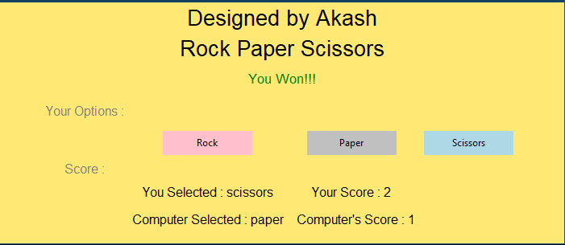

# Rock Paper Scissors

### Rock paper scissors (also known by other orderings of the three items, with "rock" sometimes being called "stone") is a hand game, usually played between two people, in which each player simultaneously forms one of three shapes with an outstretched hand. These shapes are "rock" (a closed fist), "paper" (a flat hand), and "scissors" (a fist with the index finger and middle finger extended, forming a V). A simultaneous, zero-sum game, it has only two possible outcomes: a draw, or a win for one player and a loss for the other. A player who decides to play rock will beat another player who has chosen scissors ("rock crushes scissors" or sometimes "blunts scissors"), but will lose to one who has played paper ("paper covers rock"); a play of paper will lose to a play of scissors ("scissors cuts paper"). If both players choose the same shape, the game is tied and is usually immediately replayed to break the tie. The type of game originated in China and spread with increased contact with East Asia, while developing different variants in signs over time. 

## Output:

